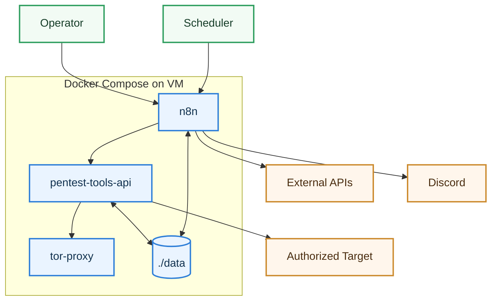
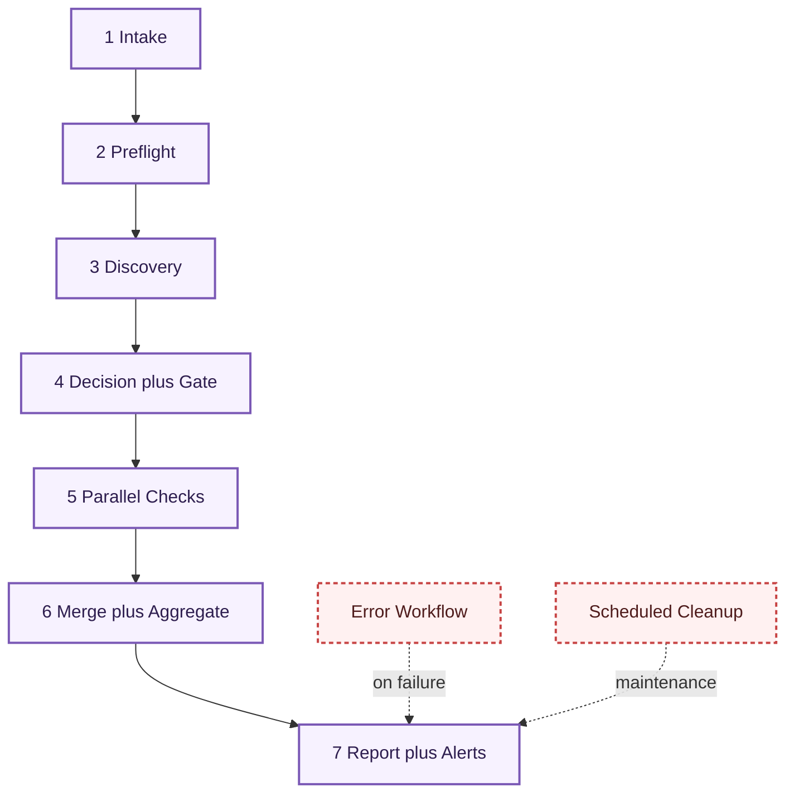

# Recon Automation — n8n Workflow

## What is This?

This project is a modular, automated penetration testing workflow built for n8n. It orchestrates a full bug bounty/pentest pipeline using open-source tools, aggregates findings, and generates professional reports. Designed for security teams, bug bounty hunters, and automation enthusiasts.

## Deployment Documentation

For full repo push + VM setup instructions, see:

- `DEPLOYMENT_GUIDE.md`

## Workflow Overview

This workflow is designed as a phased security pipeline with deterministic gates and report-ready outputs.

- **Input Channels:** Webhook trigger for on-demand scans and cron trigger for scheduled monitoring.
- **Execution Engine:** n8n orchestrates all phases and sends controlled commands to the tools container.
- **Data Plane:** Artifacts flow through `/data/temp`, then converge into normalized findings and `/data/reports`.
- **Control Plane:** Merge gates synchronize parallel branches before aggregation.
- **Safety Layer:** Allow-list enforcement, blocked-pattern checks, preflight validation, and error workflow alerts.

## Pipeline Stages

| Stage | Purpose | Typical Outputs |
|---|---|---|
| `1. Intake` | Validate target, scope, and run metadata | normalized input + `scan_id` |
| `2. Preflight` | Verify tools, directories, and templates | binary/version checks, readiness status |
| `3. Discovery` | Build attack surface from passive+active recon | subdomains, DNS, ports, endpoints, JS assets |
| `4. Guided Testing` | Select and run allowed testing commands | tool-specific findings and raw logs |
| `5. Parallel Checks` | Run multiple vulnerability families concurrently | XSS/CVE/LFI/SQLi/API/CORS/403 outputs |
| `6. Aggregation` | Merge branches and normalize findings | severity buckets + coverage metrics |
| `7. Reporting` | Build and persist final report | markdown report on disk + Discord alert |

## Architecture at a Glance

This first diagram shows the system components and how they interact.



## Workflow Lifecycle (Step-by-Step)

This second diagram shows the execution order inside the workflow.



### What Each Step Means

| Step | What happens |
|---|---|
| `1 Intake` | Validate input, normalize scope, create `scan_id` |
| `2 Preflight` | Verify tools/dirs and refresh templates |
| `3 Discovery` | Enumerate subdomains, DNS, ports, tech, endpoints, JS |
| `4 Decision and Security Gate` | Build allowed command set and block unsafe patterns |
| `5 Parallel Vulnerability Checks` | Execute XSS/CVE/LFI/SQLi/API/CORS/403 branches |
| `6 Merge and Aggregation` | Wait for branches, compute coverage, normalize findings |
| `7 Reporting and Alerts` | Generate markdown report, save file, send Discord alert |

Reading tip: start at `1 Intake` and follow arrows downward; dashed arrows are support flows.

## Why This Design Works

- **Scalable:** expensive test branches run in parallel and merge deterministically.
- **Traceable:** every run is tied to a `scan_id` and explicit temp/report artifacts.
- **Safer-by-default:** command generation is gated by allow-list and blocked-pattern controls.
- **Operationally practical:** failures route to error workflow; stale artifacts are cleaned on schedule.

## Setup & Installation

### 1. Prerequisites
- n8n v1.0+ (self-hosted recommended)
- Docker (for pentest-tools-api container)
- Git, curl, SSH access

### 2. Clone & Prepare
```sh
git clone <repo-url>
cd pentest-automation
```

### 3. Environment Variables
Copy `.env.example` to `.env` (`cp .env.example .env`) and fill it, or set these in n8n:
- SHODAN_API_KEY
- GITHUB_TOKEN
- DISCORD_WEBHOOK_URL
- GEMINI_API_KEY
- OAST_SERVER
- TOOLS_SSH_PASSWORD
- WPSCAN_API_TOKEN (optional)
- MONITOR_TARGETS (for cron monitor)

### 4. Build & Run Docker Container
```sh
docker-compose up -d
```
- Container installs all required tools and wordlists automatically.

### 5. Import Workflows
- Import `pentest_workflow.json` and `pentest_error_workflow.json` into n8n.

### 6. Start n8n
- Run n8n and configure triggers (webhook, cron).

## Usage Guide

- **Webhook Scan:** Send a POST request to `/start-scan` with `{ "target": "example.com" }`.
- **Scheduled Scan:** Set up cron for weekly monitoring.
- **Reports:** Reports are saved in `/data/reports/` and sent to Discord.
- **Error Alerts:** Failures trigger Discord alerts via the error workflow.

## Security & Concurrency

- Per-scan temp directories prevent file clashes.
- All sensitive data handled via environment variables.
- Discord webhook must be private.
- SSH access should be restricted and non-root.

## Data Retention

- Most temp artifacts are stored as SCAN_ID-suffixed files in `/data/temp` (example: `/data/temp/httpx_${SCAN_ID}.json`).
- Some tools also create per-scan directories when needed (example: `/data/temp/sqlmap_${SCAN_ID}/`).
- Scheduled cleanup removes stale temp directories/artifacts.

## License

MIT
