# AI-Powered Pentest Automation Framework

A fully containerized, autonomous penetration testing and bug bounty framework. n8n orchestrates 20+ industry-standard tools (ProjectDiscovery suite, feroxbuster, dalfox, sqlmap, and more) across isolated Docker containers, directed by a local AI agent backed by Ollama and Gemini.

---

## Architecture Overview

```mermaid
graph TD
    classDef trigger fill:#ff9900,color:#fff,stroke:#333;
    classDef recon fill:#3b82f6,color:#fff,stroke:#333;
    classDef ai filter fill:#8b5cf6,color:#fff,stroke:#333;
    classDef active fill:#ef4444,color:#fff,stroke:#333;
    classDef reporting fill:#10b981,color:#fff,stroke:#333;
    classDef stealth fill:#fbbf24,color:#000,stroke:#333;

    Start((Webhook/Domain)) -.-> |Target Scope| Phase1
    class Start trigger

    subgraph "Phase 1: Enrichment (Flow 1)"
        Phase1[Shodan API] --> Phase1b[asnmap IP Blocks]
        Phase1b --> Phase1c[GitHub API Leak Search]
        Phase1c --> Dorking[Google/Git Dorking\nRotating Proxies + Delays]
    end
    class Phase1,Phase1b,Phase1c,Dorking recon

    subgraph "Phase 2: Discovery (Flow 1)"
        Dorking --> DeepEnum["subenum-advanced.sh\nRecursive 3-4 Layers"]
        DeepEnum --> RegexFilter{Out-of-Scope\nFilter}
        RegexFilter -.-> |Drop| Trash[Trash]
        RegexFilter --> Subzy[Subzy Takeover Check]
    end
    class DeepEnum,RegexFilter,Subzy recon

    subgraph "Phase 3: Unmasking & Fingerprinting (Flow 1)"
        Subzy --> DNSX[DNS Resolution dnsx]
        DNSX --> Naabu[Naabu Port Scan]
        Naabu --> Wafw00f{wafw00f WAF Detect}
        
        Wafw00f -- Cloudflare/Akamai --> Unmask[Censys/tlsx Unmasking]
        Wafw00f -- Standard/None --> Httpx[httpx Probing on\nNaabu Ports]
        
        Unmask --> Proxy[Enable proxychains4]
        Proxy --> Httpx
        
        Httpx --> Wappalyzer[Tech Fingerprinting\nwappalyzergo]
        Wappalyzer --> Katana[Headless Crawling\nKatana JS Parse]
        Katana --> Waymore[Historical URLs\nwaymore & gau]
        Waymore --> XnLink[Endpoint Extraction\nxnLinkFinder]
        XnLink --> X8[Hidden Params\nx8]
    end
    class DNSX,Naabu,Wafw00f,Unmask,Proxy,Httpx,Wappalyzer,Katana,Waymore,XnLink,X8 stealth

    subgraph "Phase 4: Dynamic Agent & Active Scan (Flow 2)"
        X8 --> Agent{AI Agent Node\nReads Tech Stack}
        
        Agent -- WordPress --> WP[wpscan + wpprobe\n+ Nuclei WP Templates]
        Agent -- Jira --> Jira[Nuclei Jira CVEs]
        Agent -- Standard API --> Kiterunner[Feroxbuster\n+ Kiterunner]
        
        WP --> NucleiGlobal[Nuclei Exposures/Takeovers]
        Jira --> NucleiGlobal
        Kiterunner --> NucleiGlobal
        
        NucleiGlobal --> FFUF[ffuf LFI/SSTI\nPayloadsAllTheThings]
        FFUF --> Dalfox[Dalfox XSS]
        Dalfox --> SQLmap[sqlmap Batch\nUnconditional Scan]
    end
    class Agent,WP,Jira,Kiterunner,NucleiGlobal,FFUF,Dalfox,SQLmap active

    subgraph "Phase 5: Hybrid AI Verification"
        SQLmap --> Switch{n8n Severity Switch}
        
        Switch -- Low/Info --> LocalDB[(Local SQLite DB)]
        Switch -- Medium --> Ollama[Local Ollama Summarize]
        Switch -- High/Critical --> Gemini[Gemini API Verification]
    end
    class Switch,LocalDB,Ollama,Gemini ai

    subgraph "Phase 6: Reporting"
        Ollama --> RepoWrite[Save Alert.md to /data]
        Gemini --> RepoWrite2[Generate & Save Critical_Report.md to /data]
        
        RepoWrite --> DiscordWeb[Discord Webhook Alert]
        RepoWrite2 --> DiscordWeb
    end
    class RepoWrite,RepoWrite2,DiscordWeb reporting
```



---

## Quick Start (Full Flow)

Run these commands in order on your Kali Linux VM:

```bash
# 1. Install prerequisites
sudo apt update && sudo apt upgrade -y
sudo apt install -y git docker.io docker-compose curl jq
sudo systemctl enable docker --now
sudo usermod -aG docker $USER && newgrp docker

# 2. Clone the repository
git clone https://github.com/YOUR_USERNAME/pentest-automation.git
cd pentest-automation

# 3. Configure API keys
cp .env.example .env
nano .env       # Fill in: SHODAN_API_KEY, GITHUB_TOKEN, DISCORD_WEBHOOK_URL, GEMINI_API_KEY

# 4. Create data folders and add your playbook
mkdir -p data/reports data/wordlists data/templates data/temp
cp /path/to/Pentest-Playbook.md data/

# 5. Build and start all containers
docker-compose up -d --build

# Monitor bootstrap progress (takes 10-20 min on first run)
docker logs -f pentest-tools-api
# Wait until: "Bootstrap Complete. Container is armed and ready."
```

**n8n Setup (browser):**
1. Open `http://localhost:5678`
2. Create your Owner account (email + password)
3. Go to **Settings** → **Environment Variables** → add your 4 API keys
4. Click **Workflows** → **Import from File** → select `pentest_workflow.json`
5. Click **Activate** (toggle, top right)

**Run your first scan:**
```bash
curl -X POST http://localhost:5678/webhook/start-scan \
  -H "Content-Type: application/json" \
  -d '{"target": "authorized-target.com"}'
```

**Results:**
- Markdown report saved to `data/reports/authorized-target.com_scan_XXXXX.md`
- Discord alert fires automatically when the scan completes

---

## Requirements

| Spec | Minimum | Recommended |
|------|---------|-------------|
| CPU | 4 vCPU | 8 vCPU |
| RAM | 8 GB | 16+ GB |
| Disk | 50 GB | 100 GB |
| OS | Kali Linux or Ubuntu 22.04+ | Kali Linux 2024.x |

**API Keys Required:**
- [Shodan API Key](https://account.shodan.io/) — passive recon
- [GitHub Personal Access Token](https://github.com/settings/tokens) — secret leak hunting
- [Discord Webhook URL](https://support.discord.com/hc/en-us/articles/228383668) — alerting
- [Gemini API Key](https://aistudio.google.com/app/apikey) — critical finding verification

### Optional: Local AI Model (Ollama)

The workflow uses **Ollama** (running locally) to summarize medium-severity findings and drive the AI agent — at zero API cost. The Ollama service is **disabled by default** in `docker-compose.yml` because it requires significant RAM.

**Requirements to enable:** 16 GB+ RAM on the VM.

**To enable:**

1. Open `docker-compose.yml` and uncomment the `ollama` service block and the `ollama_data` volume.
2. After `docker-compose up -d --build`, pull the model once:

```bash
# Recommended: Llama3 8B (~4.7 GB download, stored in Docker volume)
docker exec -it pentest-automation-ollama-1 ollama pull llama3

# Alternative: Mistral 7B (~4.1 GB, slightly faster on CPU)
docker exec -it pentest-automation-ollama-1 ollama pull mistral
```

The model is stored in the `ollama_data` Docker volume. It survives container restarts and only needs to be pulled once.

**If Ollama is not running:** The workflow falls back automatically to a default Nuclei scan and routes all findings directly to Gemini for verification. Nothing breaks — you just pay a few extra cents per scan.

---

## Repository Structure

```
pentest-automation/
├── docker-compose.yml          # Orchestrates n8n, tools API, and Tor proxy
├── pentest-tools-api/
│   ├── Dockerfile              # Ubuntu-based container with all tools pre-installed
│   └── bootstrap.sh            # Auto-fetches latest tool binaries and wordlists on boot
├── pentest_workflow.json       # Complete n8n workflow — import this into n8n
├── .env.example                # Template for all required API keys
├── .gitignore                  # Excludes .env and /data from git
└── data/                       # NOT tracked by git — created manually on your VM
    ├── Pentest-Playbook.md     # Your personal testing playbook (AI reads this)
    ├── reports/                # Final vulnerability reports are saved here
    ├── wordlists/              # SecLists and Assetnote lists (auto-downloaded)
    ├── templates/              # Nuclei templates (auto-updated)
    └── temp/                   # Intermediate scan files (alive_subs.txt, etc.)
```

---

## Deployment Guide — From Zero to Running

### Step 1: Prepare the Host OS

On your fresh Kali Linux or Ubuntu VM:

```bash
# Update the OS
sudo apt update && sudo apt upgrade -y

# Install all required host dependencies
sudo apt install -y git docker.io docker-compose curl jq ufw

# Enable Docker and configure permissions
sudo systemctl enable docker --now
sudo usermod -aG docker $USER

# IMPORTANT: Log out and log back in before proceeding.
# The docker group permissions will not apply until you do.
newgrp docker
```

---

### Step 2: Clone the Repository

```bash
git clone https://github.com/YOUR_USERNAME/pentest-automation.git
cd pentest-automation
```

---

### Step 3: Configure API Keys

```bash
# Copy the environment template
cp .env.example .env

# Open and fill in your API keys
nano .env
```

Required values in `.env`:

```env
SHODAN_API_KEY=your_shodan_key_here
GITHUB_TOKEN=your_github_pat_here
DISCORD_WEBHOOK_URL=https://discord.com/api/webhooks/your_id/your_token
GEMINI_API_KEY=your_gemini_key_here

# Optional: comma-separated domains for weekly monitoring
MONITOR_TARGETS=target1.com,target2.com
```

> Your `.env` file is blocked from git by `.gitignore`. Your keys will never be pushed to GitHub.

---

### Step 4: Create the Data Directory Structure

The Docker containers share files via the local `data/` folder. Create it and transfer your playbook:

```bash
# Create the required folders
mkdir -p data/reports data/wordlists data/templates data/temp

# Copy your Pentest-Playbook.md into data/
# The AI Agent reads this file to select the correct tools for each target
cp /path/to/your/Pentest-Playbook.md data/
```

**Folder purpose summary:**

| Folder | Contents |
|--------|----------|
| `data/reports/` | Final Markdown vulnerability reports per scan |
| `data/wordlists/` | SecLists and Assetnote API wordlists (auto-downloaded) |
| `data/templates/` | Nuclei CVE/misconfiguration templates (auto-updated) |
| `data/temp/` | Intermediate scan output (subdomains, URLs, parameters) |

---

### Step 5: Boot the Infrastructure

```bash
docker-compose up -d --build
```

Docker Compose will:
1. Pull the official `n8n` image
2. Build the `pentest-tools-api` container from the local `Dockerfile`
3. Run `bootstrap.sh` to install the latest tool binaries, download SecLists, and update Nuclei templates
4. Start the Tor proxy container for evasion routing

> The first build takes 10–20 minutes depending on internet speed. Monitor progress:

```bash
docker logs -f pentest-tools-api
```

Wait until you see: `Bootstrap Complete. Container is armed and ready.`

Verify all three containers are running:

```bash
docker ps
# You should see: pentest-tools-api, n8n, tor-proxy — all "Up"
```

---

### Step 6: Configure SSH Access (n8n to Tools Container)

n8n issues commands to the tools container over SSH. You need to confirm the tools container accepts the connection:

```bash
# Test SSH connectivity from your host to the tools container
docker exec -it pentest-tools-api bash

# Inside the container, verify key tools are installed
which subfinder httpx nuclei katana dalfox feroxbuster sqlmap
# All should return a path — if any are missing, re-run:
# docker restart pentest-tools-api
exit
```

---

### Step 7: Access n8n and Import the Workflow

n8n is installed and managed entirely by Docker. No host-level installation is needed.

1. Open your browser and navigate to:
   ```
   http://localhost:5678
   ```
   (If accessing remotely, replace `localhost` with your VM's IP address)

2. On first boot, n8n will prompt you to create an **Owner Account**. Enter an email and a strong password.

3. Once logged in, click **Settings** (bottom left) → **Environment Variables** → add the following:

   | Variable | Value |
   |----------|-------|
   | `SHODAN_API_KEY` | Your Shodan key |
   | `GITHUB_TOKEN` | Your GitHub PAT |
   | `DISCORD_WEBHOOK_URL` | Your webhook URL |
   | `GEMINI_API_KEY` | Your Gemini key |
   | `MONITOR_TARGETS` | `target1.com,target2.com` |

4. Click **Workflows** in the left sidebar → **Add Workflow** → top-right `...` menu → **Import from File**

5. Select `pentest_workflow.json` from the cloned repository.

6. The workflow will import with all nodes pre-connected. Click **Activate** (top right toggle) to enable it.

---

### Step 8: Trigger Your First Scan

Send a POST request to the webhook trigger. You can do this from any terminal:

```bash
# Trigger a scan against a target (must be an authorized domain)
curl -X POST http://localhost:5678/webhook/start-scan \
  -H "Content-Type: application/json" \
  -d '{
    "target": "example.com",
    "out_of_scope": ["admin.example.com"]
  }'
```

Or trigger from Postman / Insomnia / any HTTP client with the same URL and body.

**What happens next (automated):**
1. Templates and wordlists are updated to the latest versions
2. ASN mapping, Shodan, and GitHub dorking run in parallel
3. Deep subdomain enumeration runs via `subenum-advanced.sh`
4. DNS resolution, HTTP probing, WAF detection, and tech fingerprinting run
5. Katana crawls live endpoints in headless mode; `gau` fetches historical URLs
6. The AI Agent (Ollama) reads your Playbook and selects the exact tools for the tech stack
7. Dalfox, Feroxbuster, and Nuclei run in parallel for active scanning
8. Findings are classified by severity and routed to Gemini (critical) or Ollama (medium)
9. A Markdown report is saved to `data/reports/` and a Discord alert fires

---

### Step 9: Reading Your Results

**Vulnerability Reports:**

Reports are saved to the shared volume and accessible immediately from your host machine:

```bash
ls data/reports/
# Output: example.com_scan_1234567890.md

cat data/reports/example.com_scan_1234567890.md
```

Each report contains:
- Summary table of findings by severity
- Critical/High section verified and written by Gemini
- Medium section summarized by Ollama
- Low/Info findings listed by endpoint

**Discord Alerts:**

Every scan sends a colour-coded embed to your Discord channel:
- Red embed = Critical or High findings confirmed
- Yellow embed = Medium findings only
- Green embed = Clean scan, no significant findings

**Weekly Monitoring:**

The workflow automatically runs every Friday at midnight. It compares discovered subdomains against the stored baseline for each domain in `MONITOR_TARGETS`. If new subdomains appear, a Discord alert fires immediately. If nothing changed, it stays silent.

---

## Operational Commands

```bash
# Start all containers
docker-compose up -d

# Stop all containers
docker-compose down

# Restart the tools container (e.g. after a tool fails to install)
docker restart pentest-tools-api

# View live logs from the tools container
docker logs -f pentest-tools-api

# View live n8n logs
docker logs -f pentest-automation-n8n-1

# Force rebuild from scratch (after Dockerfile changes)
docker-compose up -d --build --force-recreate

# Shell into the tools container
docker exec -it pentest-tools-api bash

# View a completed report
cat data/reports/<target>_scan_<id>.md
```

---

## Security Notes

- The tools container runs as `root` internally — this is required for raw socket tools (`masscan`, `naabu`). It is completely isolated from the host OS by Docker's container boundary.
- All AI-generated commands pass through a security gate in the workflow that blocks destructive patterns (`rm -rf`, `dd`, `mkfs`, etc.) before execution.
- Your `.env` file and `data/` folder are never committed to GitHub.
- Tool execution is rate-limited and Tor-proxied by default to protect your IP.

---

## Disclaimer

This framework is strictly for authorized security testing and bug bounty programs where you have explicit written permission to test the target. Unauthorized use against systems you do not own is illegal.
