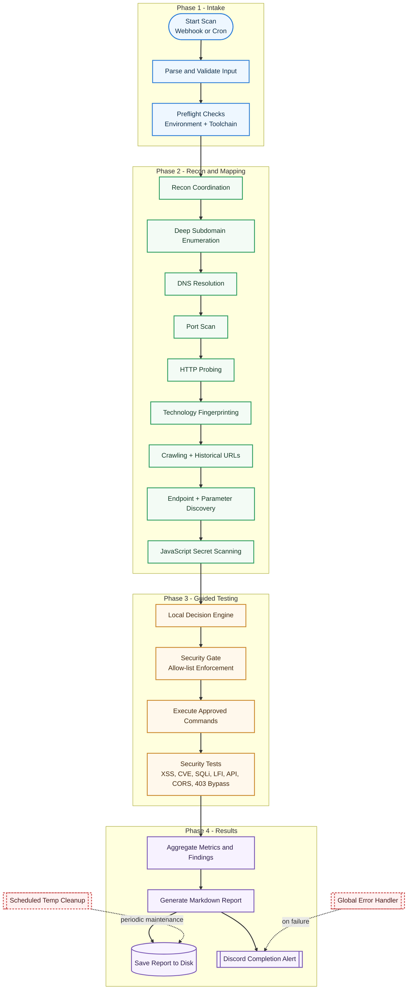

# Recon Automation — n8n Workflow

## What is This?

This project is a modular, automated penetration testing workflow built for n8n. It orchestrates a full bug bounty/pentest pipeline using open-source tools, aggregates findings, and generates professional reports. Designed for security teams, bug bounty hunters, and automation enthusiasts.

## Deployment Documentation

For full repo push + VM setup instructions, see:

- `DEPLOYMENT_GUIDE.md`

## How Does It Work?

- **Trigger:** Start a scan via webhook or schedule (cron).
- **Input Validation:** Ensures targets and scope are correct.
- **Preflight Checks:** Validates environment, toolchain, and wordlists.
- **Recon & Enumeration:** Discovers subdomains, resolves DNS, scans ports, probes HTTP, fingerprints tech, crawls, and extracts endpoints.
- **Fuzzing & Testing:** Runs XSS, directory, CVE, LFI, SQLi, parameter, API, CORS, and 403 bypass tests.
- **Aggregation:** Collects metrics and findings, generates a Markdown report, and sends Discord notifications.
- **Error Handling:** Global error workflow alerts on failures.
- **Cleanup:** Scheduled removal of old temp files.

## Visual Workflow Diagram

Below is a step-by-step diagram showing the workflow logic for new users:



**Each box represents a step in the workflow. Follow the arrows to see the scan process from start to finish.**

## Setup & Installation

### 1. Prerequisites
- n8n v1.0+ (self-hosted recommended)
- Docker (for pentest-tools-api container)
- Git, curl, SSH access

### 2. Clone & Prepare
```sh
git clone <repo-url>
cd pentest-automation
```

### 3. Environment Variables
Create a `.env` file or set these in n8n:
- SHODAN_API_KEY
- GITHUB_TOKEN
- DISCORD_WEBHOOK_URL
- GEMINI_API_KEY
- OAST_SERVER
- TOOLS_SSH_PASSWORD
- WPSCAN_API_TOKEN (optional)
- MONITOR_TARGETS (for cron monitor)

### 4. Build & Run Docker Container
```sh
docker-compose up -d
```
- Container installs all required tools and wordlists automatically.

### 5. Import Workflows
- Import `pentest_workflow.json` and `pentest_error_workflow.json` into n8n.

### 6. Start n8n
- Run n8n and configure triggers (webhook, cron).

## Usage Guide

- **Webhook Scan:** Send a POST request to `/start-scan` with `{ "target": "example.com" }`.
- **Scheduled Scan:** Set up cron for weekly monitoring.
- **Reports:** Reports are saved in `/data/reports/` and sent to Discord.
- **Error Alerts:** Failures trigger Discord alerts via the error workflow.

## Security & Concurrency

- Per-scan temp directories prevent file clashes.
- All sensitive data handled via environment variables.
- Discord webhook must be private.
- SSH access should be restricted and non-root.

## Data Retention

- Temp files are stored in `/data/temp/<scan_id>/`.
- Scheduled cleanup removes directories older than 7 days.

## License

MIT
