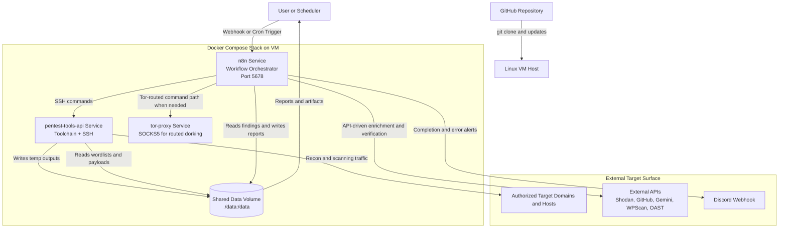

# Temporary Architecture Explanation

This is a temporary document to explain what this project is, how it works, and how data flows across components.

## 1. What This Project Is

This project is an automated security testing pipeline built around **n8n workflows** and a dedicated **tools container**.

It performs:
- reconnaissance
- endpoint discovery
- targeted vulnerability checks
- result aggregation
- report generation
- notification and error handling

It is designed to reduce manual effort while keeping execution deterministic and auditable.

## 2. High-Level Components

### 2.1 `n8n` service
- Orchestrates the full pipeline (node-to-node execution).
- Receives scan requests via webhook or schedule.
- Runs command and code nodes.
- Aggregates outputs and generates reports.

### 2.2 `pentest-tools-api` service
- Ubuntu-based container with scanning tools installed.
- Exposes SSH for n8n command execution.
- Contains toolchain: subfinder, httpx, naabu, nuclei, dalfox, ffuf, sqlmap, arjun, kiterunner, wafw00f, katana, gau, waybackurls, xnLinkFinder, trufflehog, etc.

### 2.3 `tor-proxy` service
- Used for Tor-routed dorking where configured.
- Provides privacy/routing path for selected recon actions.

### 2.4 Shared data volume (`./data:/data`)
- Shared between n8n and tools container.
- Common paths:
  - `/data/temp` for intermediate artifacts
  - `/data/reports` for final reports
  - `/data/wordlists` for wordlists/payload repositories

## 2.5 System Architecture Diagram

## 3. Runtime Architecture

The flow is split into structured phases.

1. Intake and validation
- Parse and validate target input.
- Build a scan ID for run correlation.

2. Preflight checks
- Verify binary availability and writable directories.
- Refresh nuclei templates.
- Confirm environment readiness before heavy scan phases.

3. Recon and discovery
- Subdomain enumeration (`subenum-advanced.sh`, subfinder, assetfinder, scilla).
- DNS resolution (`dnsx`).
- Port discovery (`naabu`).
- HTTP probing (`httpx`).
- WAF detection (`wafw00f`).
- Tech fingerprinting.
- Crawl/historical URL collection (`katana`, `gau`, `waybackurls`).
- Endpoint extraction (`xnLinkFinder`) and parameter discovery (`x8`, `arjun`).

4. Controlled active testing
- AI/local decision node selects from strict allow-list commands only.
- Security gate enforces allow-list and blocks dangerous patterns.
- Execute approved command(s) in tools container.

5. Parallel vulnerability checks
- XSS (`dalfox`)
- CVE/misconfig (`nuclei`)
- Payload fuzz (`ffuf`)
- SQLi (`sqlmap`)
- API route checks (`kiterunner`)
- CORS checks (`nuclei`)
- 403 bypass probes

6. Merge + aggregate
- Merge gates wait for parallel branches and side streams.
- Coverage metrics are collected.
- Aggregate node normalizes findings into severity buckets.

7. Reporting and notifications
- Build final markdown report.
- Save report to `/data/reports`.
- Send completion/failure notifications to Discord.

## 4. How Path Resolution Works

Path resolution is deterministic and does not depend on host-specific relative paths.

### 4.1 Why tools find templates/wordlists correctly
- Bootstrap installs/downloads required lists under `/data/wordlists`.
- Workflow commands use absolute paths (for example `-w /data/wordlists/...`).
- Nuclei templates are updated via `nuclei -update-templates`.
- All commands execute in the same container context where these paths exist.

### 4.2 Common examples
- Feroxbuster wordlist from SecLists.
- x8 and arjun parameter list from SecLists.
- ffuf payload list built from coffinxp + PayloadsAllTheThings.
- kiterunner list from `httparchive_apiroutes_2024.txt`.

## 5. Reliability and Safety Controls

- Preflight binary checks (fail early if tool missing).
- Writable directory checks.
- Explicit merge gates for parallel branch synchronization.
- Deterministic local decision logic for tool selection.
- Allow-list command enforcement and blocked pattern filtering.
- Secrets injected via environment variables (not passed in payload where avoidable).
- Error workflow for failure visibility.

## 6. Data Model (Output Shape)

Aggregate stage outputs a normalized result object containing:
- `target`
- `scan_id`
- `total`
- `critical[]`
- `medium[]`
- `low[]`
- `coverage{}`
- `tool_versions{}`

This shape is then used by report and alert nodes.

## 7. Security Model

- n8n UI protected with basic auth env vars.
- Secrets in `.env` only.
- SSH command execution restricted to known container endpoint.
- Discord webhook and API keys are environment-injected.
- Dangerous command patterns are blocked in security gate.

## 8. Operational Lifecycle

1. Deploy services with Docker Compose.
2. Import and activate workflows in n8n.
3. Trigger scan by webhook or cron.
4. Observe execution graph and logs.
5. Review report + alerts.
6. Scheduled cleanup removes stale temp directories.

## 9. Known Constraints

- False positives are possible in automated security tools; manual validation remains required.
- Scan performance depends on VM CPU/RAM/network and target size.
- Some checks may be rate-limited by target/CDN protections.
- OAST-based checks require a correctly configured OAST server.

## 10. Suggested Reading Order for New Team Members

1. `README.md`
2. `DEPLOYMENT_GUIDE.md`
3. `pentest_workflow.json` (import into n8n and inspect node graph)
4. `pentest-tools-api/bootstrap.sh`
5. `subenum-advanced.sh`

## 11. Temporary Notes

This document is intentionally written as a temporary architecture explainer.
If needed, it can be converted into a permanent `ARCHITECTURE.md` with diagrams and environment-specific variants.
