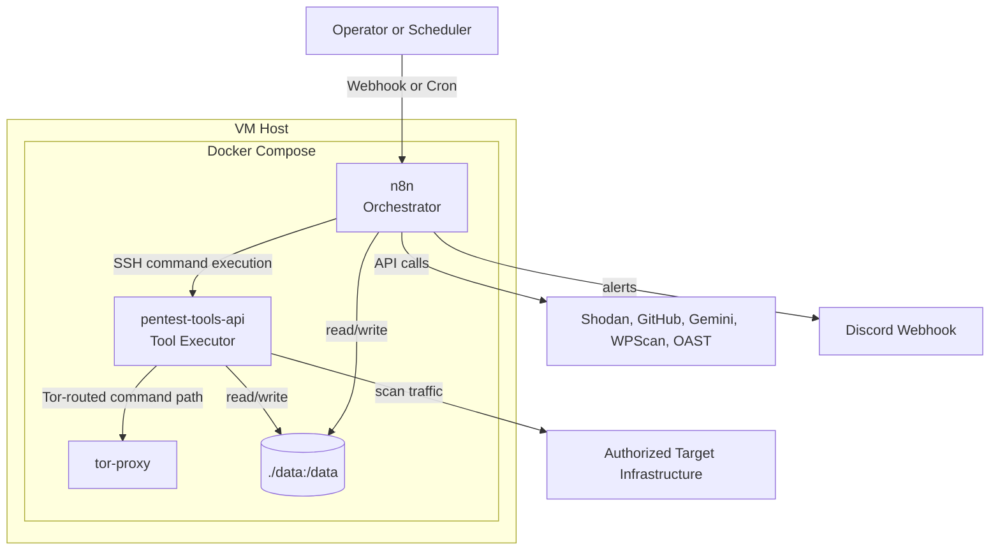

# Temporary Architecture Explanation (Clear Step-by-Step)

This document explains, in plain language and technical detail:
- what this project is
- how each component works
- the exact execution steps from trigger to report
- where files, wordlists, and templates are read/written

## 1. One-Minute Summary

This project is an automated pentest/recon pipeline running on Docker.

- `n8n` is the brain (workflow orchestrator).
- `pentest-tools-api` is the worker (all security tools run here).
- `tor-proxy` is used for selected routed operations.
- `./data` is the shared storage for temp files, wordlists, and reports.

Input enters from webhook/cron, tools run in phases, outputs are merged, normalized, and turned into a report and alert.

## 2. System Components and Responsibilities

### 2.1 `n8n` container
- Receives scan requests.
- Runs workflow logic and control nodes.
- Sends SSH commands to tools container.
- Aggregates outputs and generates final markdown report.
- Sends Discord notifications.

### 2.2 `pentest-tools-api` container
- Hosts toolchain (`subfinder`, `httpx`, `naabu`, `nuclei`, `dalfox`, `ffuf`, `sqlmap`, `arjun`, `kr`, `wafw00f`, `katana`, `gau`, `waybackurls`, `xnLinkFinder`, `trufflehog`, etc.).
- Executes commands from n8n over SSH.
- Writes raw output artifacts under `/data/temp` and reports under `/data/reports`.

### 2.3 `tor-proxy` container
- Provides socks endpoint for tor-routed dorking/paths where configured.

### 2.4 Shared volume
- Docker mount: `./data:/data`
- Main locations:
  - `/data/temp`: per-scan artifacts
  - `/data/reports`: generated reports
  - `/data/wordlists`: SecLists/payload lists/API route lists

## 3. System Diagram

## 4. Exact End-to-End Execution Steps

## 4.1 Trigger and intake
1. A request hits webhook (or cron starts scheduled run).
2. Input is validated (`target`, scope options, etc.).
3. `scan_id` is generated for traceability.

## 4.2 Preflight guardrail phase
1. n8n asks tools container to verify binaries.
2. It validates writable dirs (`/data/temp`, `/data/reports`, `/data/wordlists`, `/data/templates`).
3. It refreshes nuclei templates (`nuclei -update-templates`).
4. If anything fails, workflow stops early and error flow can alert.

## 4.3 Discovery phase
1. Subdomain enumeration (`subenum-advanced.sh` + subfinder/assetfinder/scilla).
2. DNS resolution (`dnsx`).
3. Port scan (`naabu`) preserving `host:port`.
4. HTTP probing (`httpx`) against discovered targets.
5. WAF signal collection (`wafw00f`).
6. Tech fingerprint extraction.
7. Crawl and historical URL collection (`katana`, `gau`, `waybackurls`).
8. Endpoint extraction (`xnLinkFinder`).
9. Parameter discovery (`x8`, `arjun`).

## 4.4 Controlled active testing
1. Local decision node selects tools based on observed technologies.
2. Security gate enforces strict allow-list and blocked pattern checks.
3. Approved command executes in tools container.

## 4.5 Parallel vulnerability checks
Phase 5 fans out into multiple branches in parallel:
- XSS (`dalfox`)
- CVE/misconfig (`nuclei`)
- LFI/SSTI payload fuzzing (`ffuf`)
- SQLi (`sqlmap`)
- API route probing (`kr`)
- CORS checks (`nuclei`)
- 403 bypass probes

## 4.6 Merge and aggregate
1. Merge gates wait for all required branches.
2. Coverage metrics are computed.
3. Aggregate node parses stdout + files into normalized findings:
  - `critical[]`
  - `medium[]`
  - `low[]`
  - `coverage{}`
  - `tool_versions{}`

## 4.7 Reporting and alerting
1. Final markdown report is generated.
2. Report is saved to `/data/reports`.
3. Completion notification sent to Discord.
4. Error workflow handles failures with alerting.

## 5. How Template/Wordlist Paths Are Resolved (Important)

This is deterministic and consistent because of three rules.

1. Bootstrap downloads resources to fixed paths
- `/data/wordlists/SecLists/...`
- `/data/wordlists/payloads/...`
- `/data/wordlists/httparchive_apiroutes_2024.txt`

2. Commands use absolute paths
- Example: `-w /data/wordlists/SecLists/...`
- No dependence on current directory.

3. All commands run inside same tools container context
- The paths exist where commands execute.

Nuclei specifics:
- Template repo is updated by `nuclei -update-templates`.
- Commands reference template categories (`cves/`, `vulnerabilities/`, `misconfiguration/`, `exposures/`, `vulnerabilities/cors/`).

## 6. Data and File Lifecycle

1. Each scan writes temp artifacts with `SCAN_ID` under `/data/temp`.
2. Intermediate files are reused across phases (recon -> endpoints -> testing -> aggregate).
3. Final report is written to `/data/reports`.
4. Scheduled cleanup removes stale temp directories/artifacts.

## 7. Reliability Controls Already Implemented

- Preflight tool and directory checks.
- Merge gates to avoid race conditions between parallel branches.
- Safe command allow-list + blocked patterns.
- Fail-closed behavior for missing OAST in relevant checks.
- Runtime environment variable usage for secrets.
- Structured aggregation model for deterministic output.

## 8. Security Controls

- `N8N_BASIC_AUTH_*` protects n8n UI.
- Secrets stay in `.env` (not hardcoded in workflow payload where avoidable).
- SSH execution is constrained to expected container endpoint.
- Discord/API keys are environment-injected.

## 9. Operator Steps (How You Actually Run It)

1. `docker compose up -d --build`
2. Open n8n UI (`http://<vm-ip>:5678`)
3. Import `pentest_workflow.json` and `pentest_error_workflow.json`
4. Activate both workflows
5. Trigger scan via webhook payload
6. Watch execution graph and logs
7. Validate report in `/data/reports`

## 10. What Can Still Go Wrong

- Target rate-limiting/WAF may reduce findings.
- External API quotas may limit enrichment.
- Any automated scanner can produce false positives.
- Large scopes need enough VM CPU/RAM and more runtime.

## 11. Quick Reference

- Main workflow file: `pentest_workflow.json`
- Error workflow file: `pentest_error_workflow.json`
- Tool bootstrap: `pentest-tools-api/bootstrap.sh`
- Subdomain script: `subenum-advanced.sh`
- Deployment runbook: `DEPLOYMENT_GUIDE.md`

This is a temporary explanation document and can be promoted later to a permanent `ARCHITECTURE.md`.
